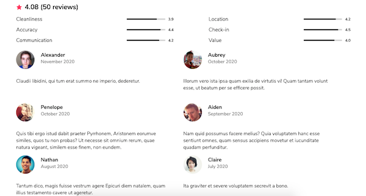
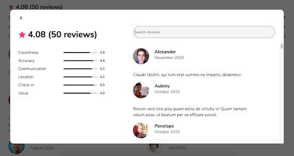

# Fullstack Airbnb-Styled SOA Reviews Module

Service-Oriented Architecture app modeled from the Airbnb Reviews service, built to:
- seed and persist data (averages, users, and reviews) for 100 unique product IDs,
- run alongside other services via proxy server,
- display a full page of data per each unique product ID,
- run locally, or be deployed via Amazon EC2.

 Built with the MERN stack, React Styled-Components, and React Router DOM.

### Default view:
<p align="center">

</p>

### Modal view:
<p align="center">

</p>

## Setup on Local

1. `git clone`
1. install dependencies with `npm install`
1. seed database with `npm run seed`
1. start server with `npm run start`
1. build bundle with `npm run build`
1. verify app up and running at `localhost:3001/rooms/:id` (for id values 0-99)
1. for development, start webpack with `npm run react-dev`

## Setup on EC2

1. create and launch EC2 instance with Ubuntu AMI on t2 micro (or preferred settings)
1. edit Instance Inbound Rules by adding "All Traffic" from "Anywhere," or preferred security settings
1. add pem key to root and .gitignore, and in Terminal make pem private with `chmod 400 [.pem file]`
1. connect to instance with `ssh -i "[pemKeyName].pem" ubuntu@[Public IPv4 DNS]`
NOTE: Public IPv4 address will change every time instance shuts down. To avoid repeated IP changes during development, restart instance instead of shutting down.
1. install Node on Ubuntu with
```
curl -o- https://raw.githubusercontent.com/nvm-sh/nvm/v0.34.0/install.sh | bash
. ~/.nvm/nvm.sh
nvm install node
```
6. install Git on Ubuntu with `sudo apt-get install`
1. `git clone` repo
1. install dependencies with `npm install`
1. install MySQL with
```
sudo apt update
sudo apt-get install mysql-server -y
sudo mysql
create database [name]
```
10. add MySQL credentials (`SQL_USER`, `SQL_PASS`, & `SQL_DB`) to root .env file with `sudo vim .env`
1. seed database with `npm run seed`
1. start server with `npm run start`
1. verify app up and running at url `http://[Public IPv4 DNS]:3001/rooms/:id` (for id values 0-99).
NOTE: must use `http`, not `https`, or will return error
1. to stop instance, go to instance page and click Instance State > Stop Instance.

## Setup with Proxy

Complete local or EC2 setup, and follow setup instructions for [proxy](https://github.com/jhou12/airbnb-soa-proxy).

## Related Projects
  - [Airbnb SOA Proxy](https://github.com/jhou12/airbnb-soa-proxy)
  - [Airbnb SOA Carousel Module](https://github.com/jhou12/airbnb-soa-carousel-module)